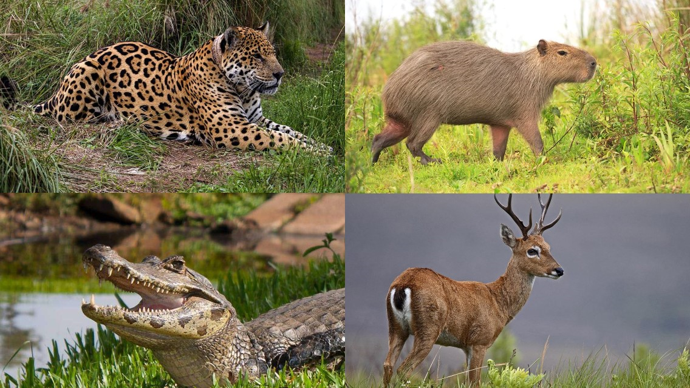

# Bioparque Unahur

En este caso van a tener que modelar el Bioparque Unahur. En él se encuentran algunas de las especies autóctonas de nuestro país, 
como el Yaguareté y el Venado de las Pampas. Estos animales están a cargo del *guardaparques*, el cual se encargará de alimentar a los animales.

## Modelando el bioparque

Al parque que alberga los animales se le debe poder enviar los siguientes mensajes:
- Poder agregar y sacar animales del recinto (en el caso que necesiten ser trasladados).
- La cantidad total de animales que hay en el parque.
- Si el establecimiento está con la cantidad máxima de animales. El maximo de animales que puede albergar el bioparque es 10.
*Aclaracion* : Si en el bioparque ya hay 10 animales, al querer agregar el numero 11 el metodo no deberia hacer nada.
- Poder preguntarle si el primer animal ingresado y el ultimo tienen un peso mayor a 50 kilos.
- Si es un bioparque con predominancia de animales carnivoros, esto tiene que devolver un True o False.

## El guardaparques

Para modelar el guardabosques debemos tener en cuenta las siguientes cosas:
- Saber su nivel de energia (que arranca en 100), y decrece en 5 cada vez que alimenta a un animal. No puede dar numeros negativos la energia. 
- Alimentar a un animal. La comida va a depender si son *carnivoros* o no. La comida la modelaremos luego.
- Parar a descansar. Esto restaura la energia del guarparques (vuelve a 100). Pero solo puede descansar si todos los animales del bioparque comieron aunque sea una vez,
de lo contrario no restaura la energia.

## Los animales

De los animales nos interesa saber su energia y su *dieta*. Si no han comido nada, su dieta estará vacia.

*Yaguarete*

*Venado de las pampas*

*Yacaré overo (Caiman)*

*Carpincho* 

## Bonus

- Se debe poder preguntarle al guardaparques si fue ordenado al alimentar a los animales. Esto quiere decir que a partir de la primera
ración, las demas fueron igual o mas chicas.

